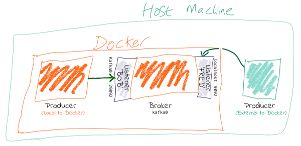

# Kafka Listeners Explained !

> A simple docker-compose with Kafka / Zookeeper / Ngrok / Kaf to demo how Kafka listerners work



> Credits to [Robin Moffatt](https://www.confluent.io/blog/author/robin-moffatt) for his great article on [Kafka listeners](https://www.confluent.io/blog/kafka-listeners-explained/)

## :rocket: Getting started

* Sign up or Login to [Ngrok](https://dashboard.ngrok.com/login) > `Your Authtoken` and copy your `token` (You can't use TCP forwarding without an Ngrok account)

```bash
export NGROK_TOKEN=<your-ngrok-token>
make up
```

* Get onto the `Kaf` container

```bash
make goto-kaf
```

* Cleanup stack

```bash
make down
```
